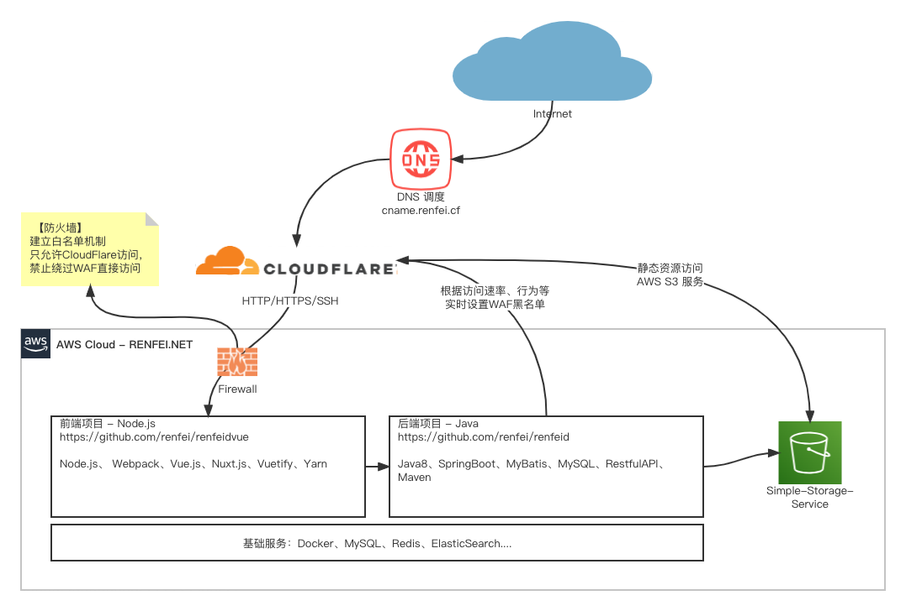

# renfeid

[](https://github.com/renfei/renfeid/blob/master/LICENSE)

这是 [任霏的个人博客与网站](https://www.renfei.net) 的代码库，能进到这个代码库说明你很有品位嘛。

我的网站结构为前后端分离，所以会产生前后端两个子项目：

| 后端                                                                             | 前端                                                                               |
|--------------------------------------------------------------------------------|----------------------------------------------------------------------------------|
| 所在目录：[renfeid](./renfeid)                                                      | 所在目录：[renfeidvue](./renfeidvue)                                                  |
| 技术栈：Java8、SpringBoot、MyBatis、MariaDB、RestfulAPI、Maven                          | 技术栈： Node.js、 Webpack、Vue.js、Nuxt.js、Vuetify、Yarn                                |
| 简要说明：尝试过SpringCloud微服务架构，但对于个人网站来说过于沉重和耗费资源，所以我用maven多模块的方式进行了拆分，将来可以改造为微服务架构。 | 简要说明：之前一直没有使用Vue是因为SPA对SEO不友好，但随着前端技术的完善，Nuxt的SSR服务器端渲染已经很成熟了，本次是我第一次尝试前台也使用Vue。 |
| 自我点评：采用前后端分离架构，是目前行业比较流行的结构，SpringBoot也是最新版本的依赖。                               | 自我点评：本人非前端专业，只是业余学习，很可能使用姿势不符合行业规范，前端项目仅供参考。                                     |

## 目录结构

### 后端项目目录结构

### 前端项目目录结构

## 构建

### 后端项目构建

后端使用 ```Maven``` 来管理依赖，如果你已经安装了 ```Maven``` 可以直接使用 mvn 命令，如果你的机器上没有安装  ```Maven```，那么你可以使用目录中自带的 ```mvnw``` 来代替 ```mvn``` 命令。

<details>
<summary>点此展开查看构建命令</summary>

首先，进入前端项目的 ```renfeid``` 目录里执行下面的命令：

```bash
# 清除缓存
mvn clean

# 编译项目
mvn compile

# 执行单元测试
mvn test

# 项目打包
mvn package
```
</details>

### 前端项目构建

前端我使用 ```yarn``` 来代替 ```npm``` 包管理器，后端同学注意了这里的 ```yarn``` 跟 ```Apache Hadoop YARN``` 没有任何关系，完全是两个东西。

<details>
<summary>点此展开查看构建命令</summary>

首先，进入前端项目的 ```renfeidvue``` 目录里执行下面的命令：

```bash
# install dependencies
$ yarn install

# serve with hot reload at localhost:3000
$ yarn dev

# build for production and launch server
$ yarn build
$ yarn start

# generate static project
$ yarn generate
```
</details>
